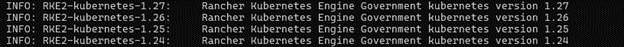
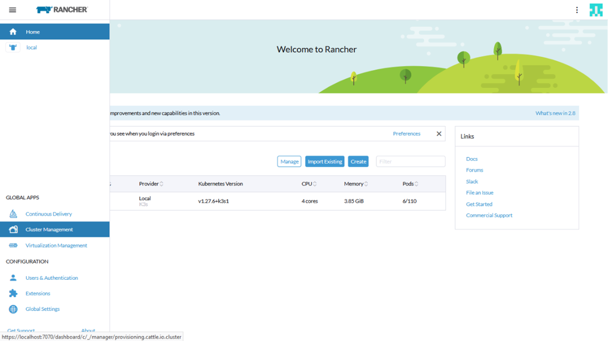
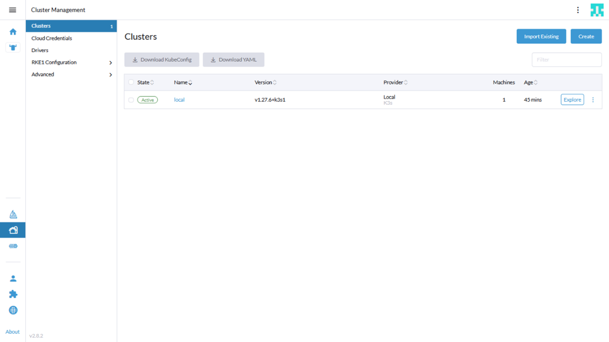
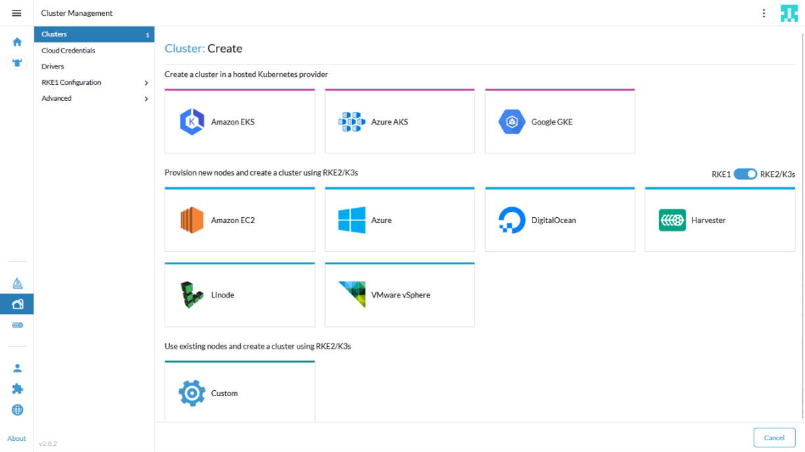
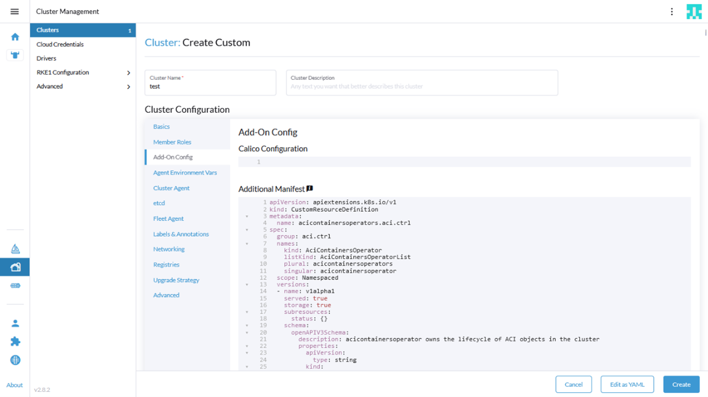
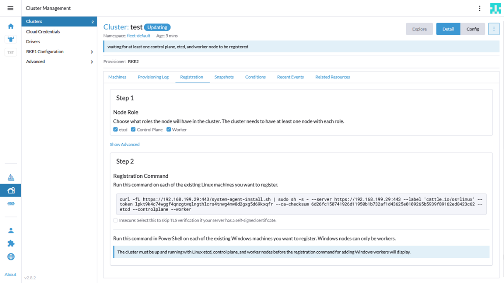
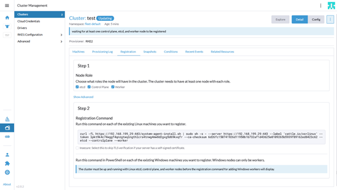
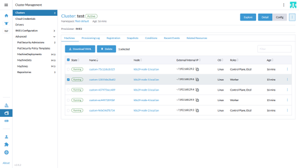
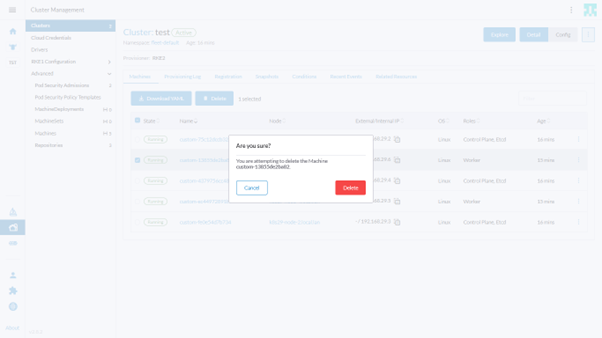

# Installing RKE2 cluster with ACI-CNI 6.0.4.1 from Rancher UI

# Table of contents
- [Table of contents](#table-of-contents)
  - [Cluster Installation](#cluster-installation)
    - [Pre-requisites](#pre-requisites)
    - [Installation](#installation)
  - [Cluster Operations](#cluster-operations)
    - [ACI-CNI Upgrade](#aci-cni-upgrade)
    - [ACI-CNI Configuration Update](#aci-cni-configuration-upgrade)
    - [Cluster Node Add/Removal](#cluster-node-addremoval)
      - [Addition](#addition)
      - [Removal](#removal)

## Cluster Installation 

### Pre-requisites

0. \[Optional\] If you are installing the Logging and Monitoring apps on top of your RKE2 cluster and you want to override the "cattle-logging" and "cattle-prometheus" default namespaces. Set the variables 'logging_namespace' and 'monitoring_namespace' under 'rke2_config' to specify the name of the namespace in which the apps are desired to be installed.

    
    
1. Install latest acc-provision 
    ```sh
    sudo pip3 install acc-provision==6.0.4.1.post1
    ```
2. Generate aci-cni manifests using acc-provision tool with the appropriate RKE2 flavor.

    

    ```sh
    acc-provision -c acc_provision_input.yaml -u <username> -p <password> -f RKE2-kubernetes-1.27 -o rke2-manifests.yaml
    ```

### Installation 

**Follow the below procedure from the rancher UI for installation:**

1. From Rancher UI, go to **Cluster Management** and then click on **Create**.

    

    

2. On the right side of the page, adjust the toggle such that
    **RKE2/K3s** option is enabled cluster option. Go on to select the custom cluster option at the bottom of the page.

     

3.  Enter the Cluster name in the cluster configuration page and select the Kubernetes version.

    ­­­

4. Add any private registries under the **Registries** section.

    

5. Click on Add-On Config section, copy the generated manifest (rke2-manifests.yaml from pre-requisites step 2 ) into the **Additional Manifest** UI text box.

    

6.  Click on 'Edit Yaml' option, and change the field 'cni' from 'calico' (default) to 'none'

    

7. Click on 'Create'.

2. From the cluster management page, select the new cluster.

    

9. Go to Registration tab. Select the node roles and copy the command.

    

10.  Go to the node and run the command to register the node in the cluster.

11.  Repeat steps 9 & 10 to register more nodes. 

12. Wait for some time, a bootstrap node will be setup first followed by the rest and the cluster will go to an active state. 

    

##  Cluster Operations 

This assumes the following two steps have already been performed:

1.  Generate ACI-CNI manifests using acc-provision and the appropriate RKE2 flavor

2.  Create cluster with cni=none, and copy the generated aci-cni manifests in the Add-On Config section of cluster in Rancher UI

### ACI-CNI Upgrade 

1. Uninstall old acc-provision:
    ```sh
    sudo apt remove acc-provision
    ```
2. Install new release of acc-provision:
   ```sh
   sudo pip3 install acc-provision==6.0.4.1.post1
   ```
3.  For using newer images, edit the image tags in registry section of acc_provision_input.yaml to latest release tags

    eg: from 6.0.4.1.81c2369 to 6.0.4.2.81c2369

4. Generate new aci cni manifests    
    ```sh
    acc-provision -c acc_provision_input.yaml -u <username> -p <password> -f RKE2-kubernetes-1.27 -o rke2-manifests-6041.yaml
    ```
5.  Replace the old manifests in Add-On Config section of the cluster on Rancher UI with newly generated manifests

    

### ACI-CNI Configuration Update 

1. If any variable configuration has to be added/modified/removed, change the configuration accordingly in the input file.

    eg: add the variable 'apic_subscription_delay: 100' under aci_configsection of acc_provision_input file.

2. Generate the new manifests using acc-provision tool.
   ```sh
   acc-provision -c acc_provision_input.yaml -u <username> -p <password> -f RKE2-kubernetes-1.27 -o rke2-manifests.yaml
   ```

3.  On Rancher UI, From Cluster Management Page, select the 'Edit Config' option for the cluster whose configuration should be modified

    

4.  Replace the old manifests in 'Add-on Config' section of the cluster on Rancher UI with newly generated manifests and click on save.

    

5. Wait until cluster goes to active state.

   We can verify the ConfigMap resources in aci-containers-system namespace to see if the variable change is reflected in them. For example, 'apic_subscription_delay: 100' is being added in aci-containers-config ConfigMap.
   ```sh
   kubectl get cm -n aci-containers-system aci-containers-config -o yaml 
   ```
    Before Update:

    

    After Update:

    

### Cluster Node Add/Removal 

#### Addition 

1.  Click on your cluster from the Cluster Management page, Go to 'Registration' tab. Select the node roles and copy the command.

    

2.  Login to the node you want to register and run the copied command to add the node to cluster.

3.  Wait for some time, the new node will go to Running state and the cluster to an Active state.

#### Removal 

1.  Click on your cluster from the Cluster Management page, select the node you want to remove from the cluster and click on the delete option.

    

2. Click Delete in the pop-up to confirm deletion.

   

Notes

1.  You will need to specify any additional proxy configuration in the Agent Environment Vars section while installing, if running behind proxy.

    
