# Installing RKE2 cluster with ACI-CNI from Rancher UI

# Table of contents
- [Installing RKE2 cluster with ACI-CNI from Rancher UI](#installing-rke2-cluster-with-aci-cni-from-rancher-ui)
- [Table of contents](#table-of-contents)
  - [Cluster Installation](#cluster-installation)
    - [Pre-requisites](#pre-requisites)
    - [Installation](#installation)
  - [Cluster Operations](#cluster-operations)
    - [ACI-CNI Upgrade](#aci-cni-upgrade)
    - [ACI-CNI Configuration Update](#aci-cni-configuration-update)
    - [Cluster Node Add/Removal](#cluster-node-addremoval)
      - [Addition](#addition)
      - [Removal](#removal)

## Cluster Installation 

### Pre-requisites
 Complete the following tasks before proceeding with installation, following the referenced procedures on the Rancher and Cisco websites. 
1.  Configure the following:
    -   A Cisco Application Centric Infrastructure (ACI) tenant
    -   An attachable entity profile (AEP)
    -   A VRF
    -   A Layer 3 outside connection (L3Out)
    -   A Layer 3 external network for the cluster you plan to provision 

    > Note: The VRF and L3Out in Cisco ACI that you use to provide outside connectivity to Kubernetes external services can be in any tenant. The VRF and L3Out are usually in the common tenant or in a tenant that you dedicate to the Kubernetes cluster. You can also have separate VRFs, one for the Kubernetes bridge domains and one for the L3Out, and you can configure route leaking between them.  

2. Prepare the nodes for Cisco ACI Container Network Interface (CNI) plug-in installation.

    Follow the procedures in *[Cisco ACI and Kubernetes Integration](https://www.cisco.com/c/en/us/td/docs/switches/datacenter/aci/apic/sw/kb/b_Kubernetes_Integration_with_ACI.html#concept_ew3_bnz_n1b)* on cisco.com until the end of the section, *Preparing the Kubernetes Nodes*.
    
    > Note: ACI CNI in nested mode is only supported with VMM-integrated VMware (with Distributed Virtual Switch).

3. Have a working [Rancher server installation](https://ranchermanager.docs.rancher.com/getting-started/installation-and-upgrade), reachable from your user cluster nodes.

4. Ensure that the version of Kubernetes that you want to upgrade to is supported for your environment. See the [Cisco ACI Virtualization Compatibility Matrix](https://www.cisco.com/c/dam/en/us/td/docs/Website/datacenter/aci/virtualization/matrix/virtmatrix.html) and all supported versions on the Rancher website.

5.  Fulfill the requirements for the nodes where you will install apps and services, including networking requirements for RKE2. See the page Node Requirements on the Rancher and RKE2 websites.

6. Install acc-provision.
    ```sh
    pip install acc-provision==<version>
    ```
    > Note: version will be same as the ACI-CNI version you are trying to install. Full list [here](https://pypi.org/project/acc-provision/#history).

7. Generate ACI-CNI manifests using acc-provision tool with the appropriate RKE2 flavor.

    To list available flavors:
    ```sh
    acc-provision --list-flavors
    ```

    The below command uses the RKE2-kubernetes-1.27 flavor to generate the manifests and writes it to file named rke2-manifests.yaml:

    ```sh
    acc-provision -a -c acc_provision_input.yaml -u <username> -p <password> -f RKE2-kubernetes-1.27 -o rke2-manifests.yaml
    ```

    > Note: the `-a` option will push the config to your ACI Fabric and create the required resources.  
    > Use `-h` or `--help` to see all available options.

    > *Optional*: If you are installing the Logging and Monitoring apps on top of your RKE2 cluster and you want to override the "cattle-logging" and "cattle-prometheus" default namespaces. Set the variables 'logging_namespace' and 'monitoring_namespace' under 'rke2_config' to specify the name of the namespace in which the apps are desired to be installed.

    Refer [Cisco APIC Container Plug-in Release Notes](https://www.cisco.com/c/en/us/support/cloud-systems-management/application-policy-infrastructure-controller-apic/tsd-products-support-series-home.html) for details on available configuration options/features.

### Installation 

**Follow the below procedure from the rancher UI for installation:**

1. From Rancher UI, go to **Cluster Management** and then click on **Create**.

    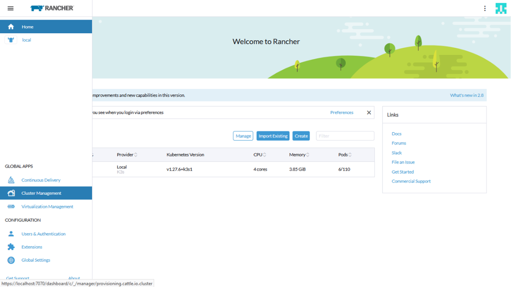

    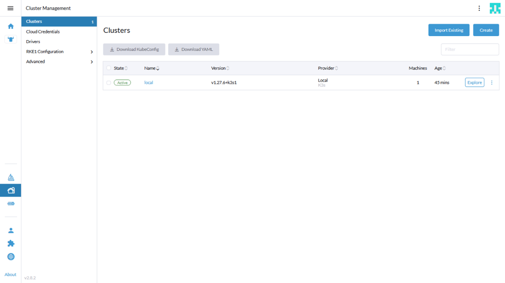

2. On the right side of the page, adjust the toggle such that
    **RKE2/K3s** option is enabled cluster option. Go on to select the custom cluster option at the bottom of the page.

     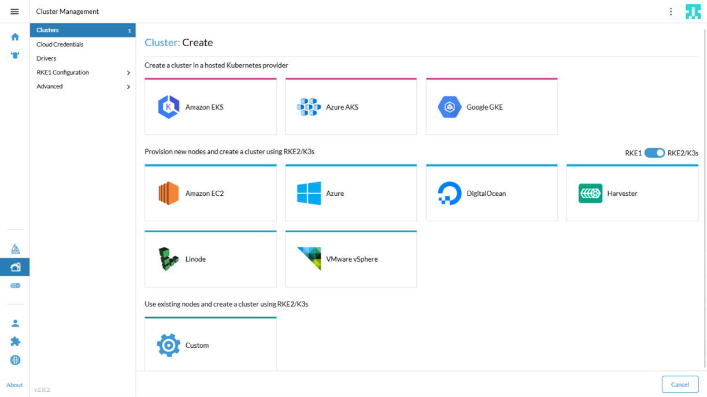

3.  Enter the Cluster name in the cluster configuration page and select the Kubernetes version.

    ­­­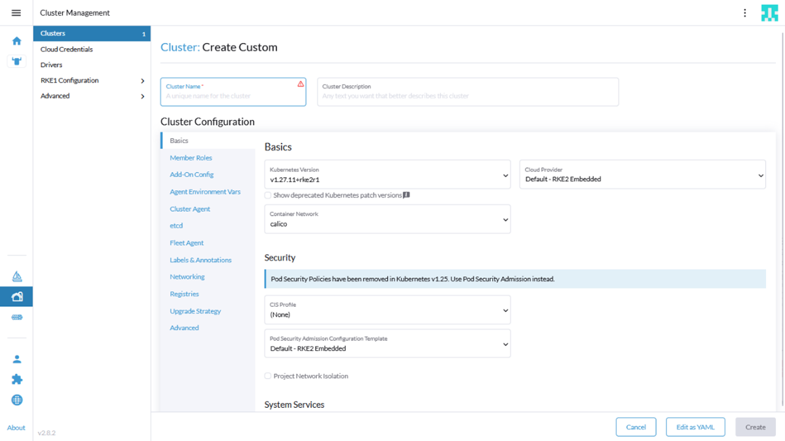

4. Add any private registries under the **Registries** section.

    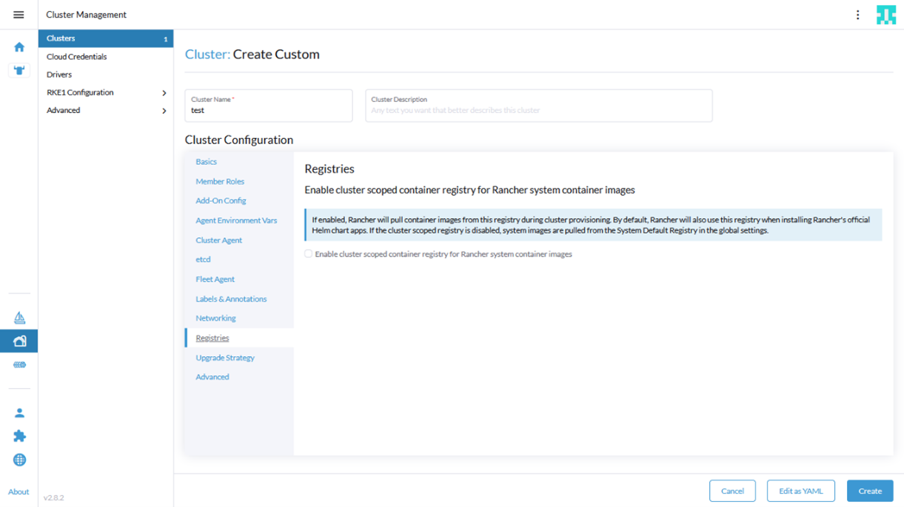

5. Click on Add-On Config section, copy the generated manifest (rke2-manifests.yaml from pre-requisites step 2 ) into the **Additional Manifest** UI text box.

    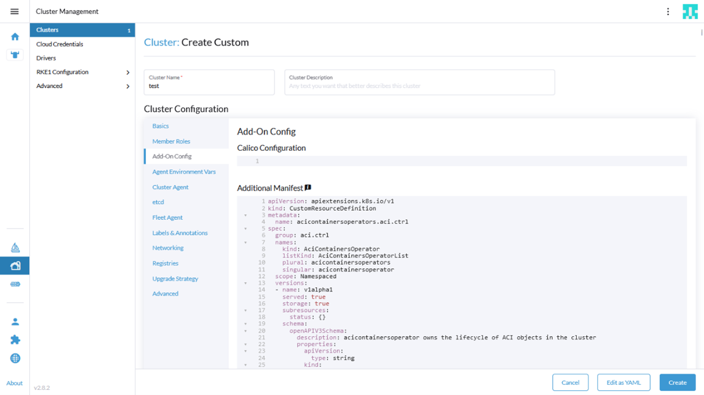

6.  Click on 'Edit Yaml' option, and change the field 'cni' from 'calico' (default) to 'none'

    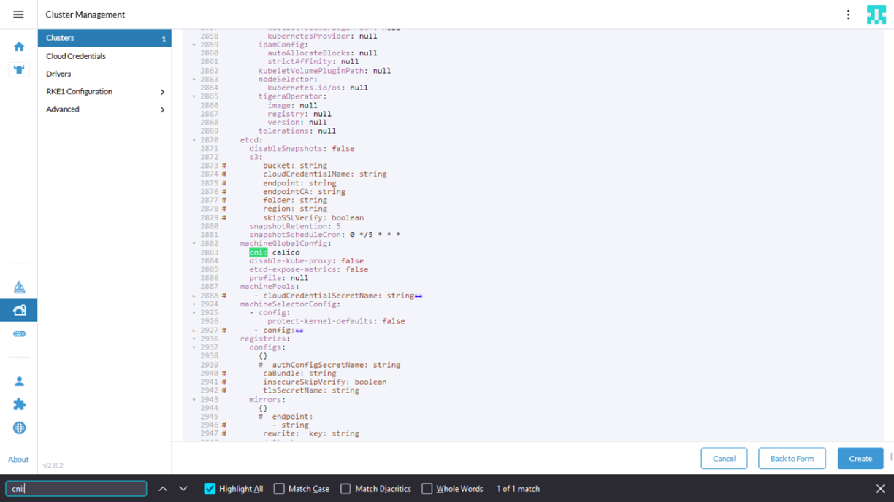

7. Click on 'Create'.

2. From the cluster management page, select the new cluster.

    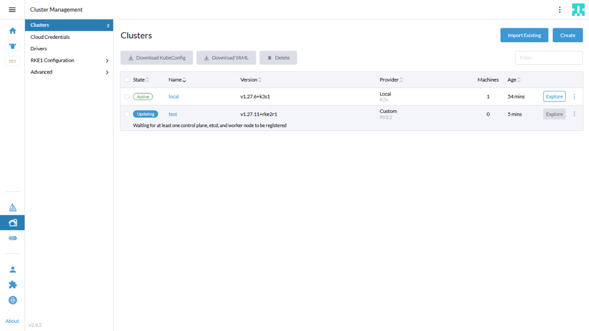

9. Go to Registration tab. Select the node roles and copy the command.

    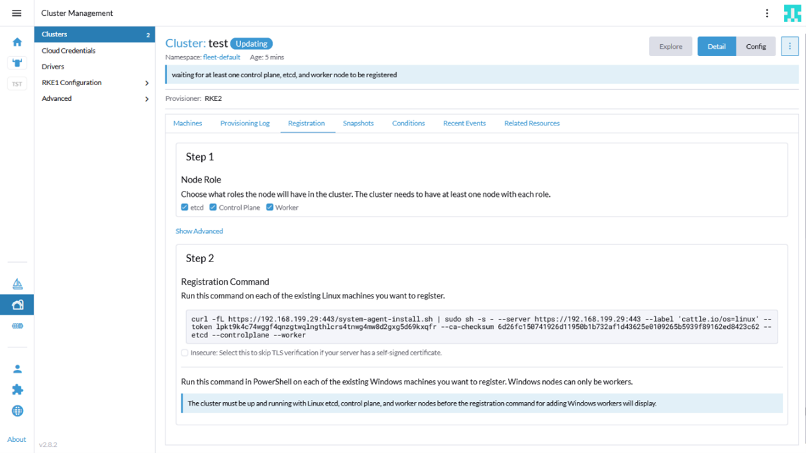

10.  Go to the node and run the command to register the node in the cluster.

11.  Repeat steps 9 & 10 to register more nodes. 

12. Wait for some time, a bootstrap node will be setup first followed by the rest and the cluster will go to an active state. 

    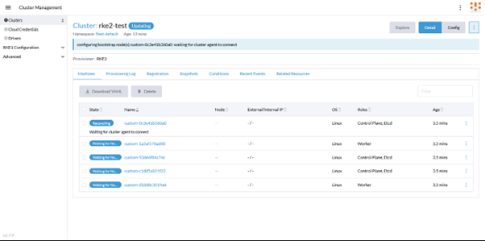

##  Cluster Operations 

This assumes that a cluster exists, created following above steps.

### ACI-CNI Upgrade 

1. Uninstall old acc-provision:
    ```sh
    pip uninstall acc-provision
    ```
2. Install new release of acc-provision:
   ```sh
   pip install acc-provision==<new_version>
   ```
3. Generate new ACI-CNI manifests using appropriate flavor
    ```sh
    acc-provision --upgrade -c acc_provision_input.yaml -u <username> -p <password> -f RKE2-kubernetes-1.27 -o rke2-manifests-new.yaml
    ```
4.  Replace the old manifests in Add-On Config section of the cluster on Rancher UI with newly generated manifests
    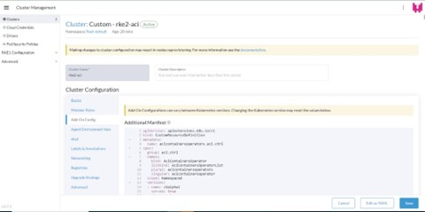

### ACI-CNI Configuration Update 

1. If any variable configuration has to be added/modified/removed, change the configuration accordingly in the input file.

    eg: add the variable 'apic_subscription_delay: 100' under aci_config section of acc_provision_input file.

2. Generate the new manifests using acc-provision tool.
   ```sh
   acc-provision -c acc_provision_input.yaml -u <username> -p <password> -f RKE2-kubernetes-1.27 -o rke2-manifests.yaml
   ```

3.  On Rancher UI, From Cluster Management Page, select the 'Edit Config' option for the cluster whose configuration should be modified

    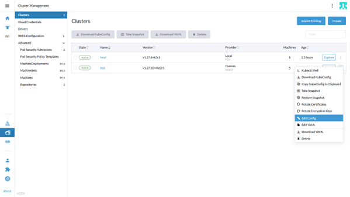

4.  Replace the old manifests in 'Add-on Config' section of the cluster on Rancher UI with newly generated manifests and click on save.

    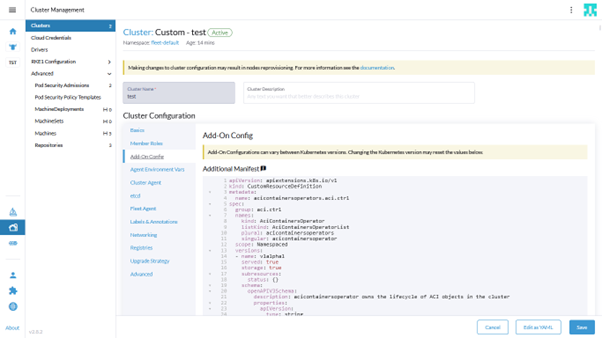

5. Wait until cluster goes to active state.

   We can verify the ConfigMap resources in aci-containers-system namespace to see if the variable change is reflected in them. For example, whether 'apic_subscription_delay: 100' is being added in aci-containers-config ConfigMap.
   ```sh
   kubectl get cm -n aci-containers-system aci-containers-config -o yaml 
   ```
    Before Update:

    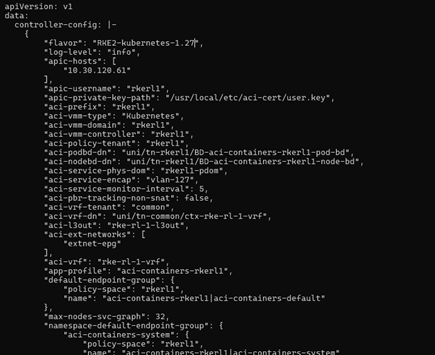

    After Update:

    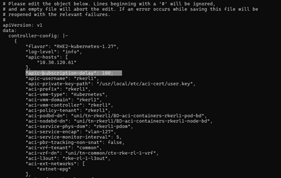

### Cluster Node Add/Removal 

#### Addition 

1.  Click on your cluster from the Cluster Management page, Go to 'Registration' tab. Select the node roles and copy the command.

    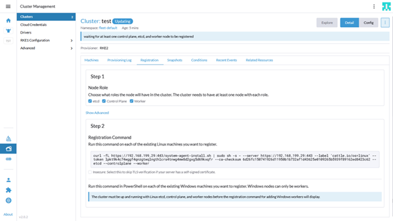

2.  Login to the node you want to register and run the copied command to add the node to cluster.

3.  Wait for some time, the new node will go to Running state and the cluster to Active state.

#### Removal 

1.  Click on your cluster from the Cluster Management page, select the node you want to remove from the cluster and click on the delete option.

    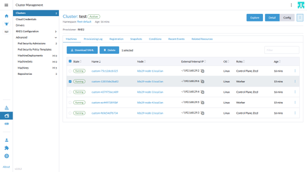

2. Click Delete in the pop-up to confirm deletion.

   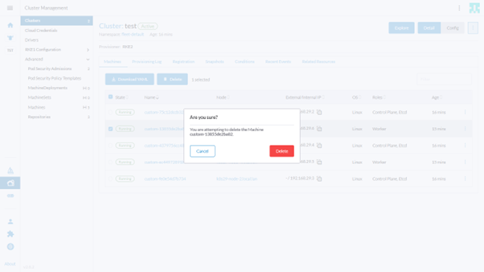

Notes

1.  You will need to specify any additional proxy configuration in the Agent Environment Vars section while installing, if running behind proxy.

    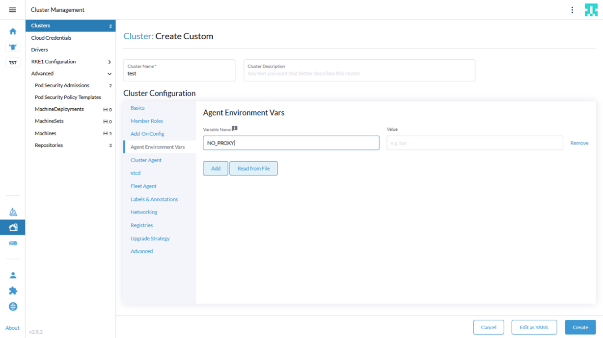
